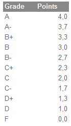
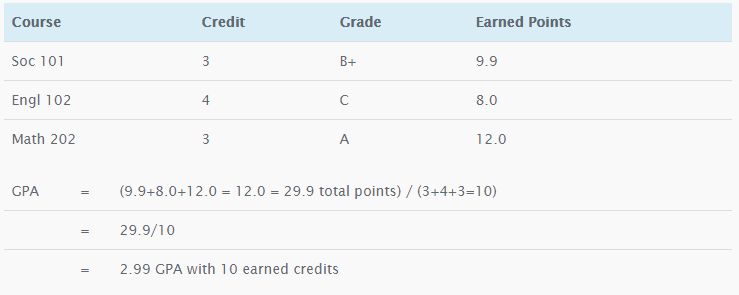
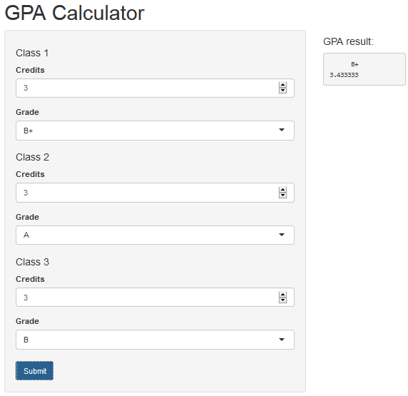

## How to calculate the GPA

* Basically, it goes as follows: Each course is given a certain number of "units" or "credits", depending on the content of the course.

* Your GPA is calculated using your grades and the credit point value of the courses you have completed. 

* The process is the same whether you are working on secondary or college grades.

--- 

## How to calculate the GPA (Cont.)

* GPA assumes a grading scale of A, A-, B+, B, B-, C+, C, C-, D+,D, F. Each grade is assigned a number of grade points. An A grade receives 4 points, a A-=3.7, a B+=3.3, a B=3, a B-= 2.7, a C+=2.3, a C=2, a C-=1.7, a D+=1.2, a D=1, and an F=0. 

    

--- 

## How to calculate the GPA (Cont.)

* If you take a three unit class and receive an A grade, you receive 3 units times 4 points (for the A), which gives a total of 12 grade points for the course. 

* Example:

    

---

## My GPA Calculator

* I built an GPA apps very easy to use. I hope you enjoy!

    

